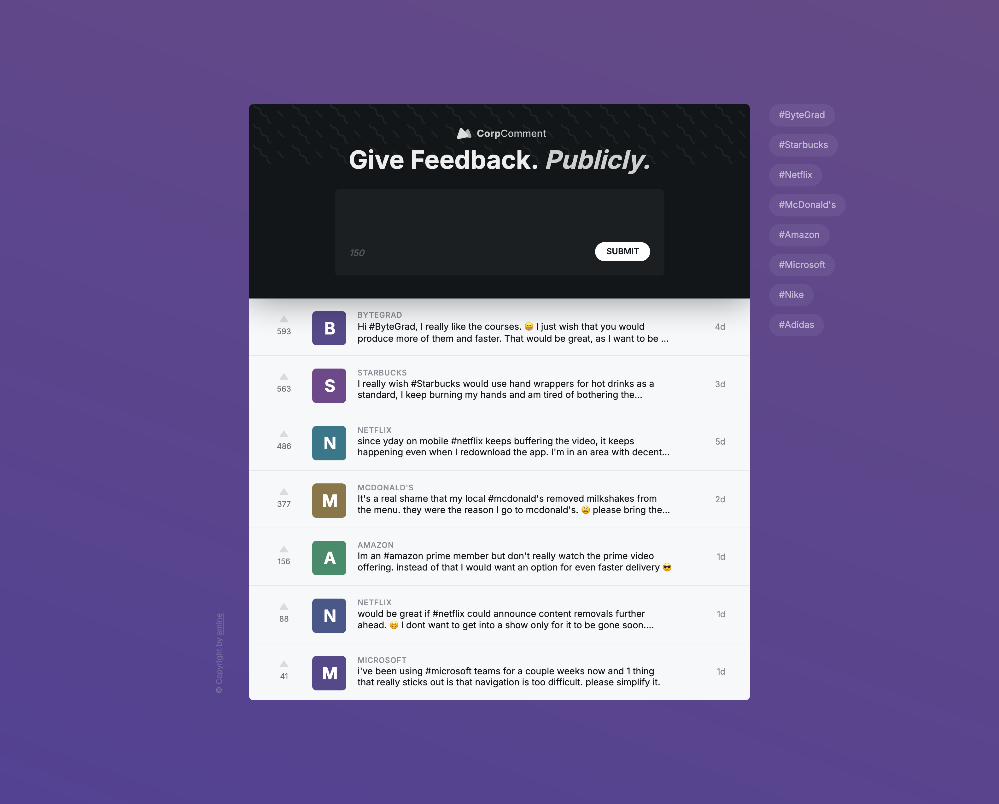

# Feedback & Hashtag Explorer

[](https://github.com/yourusername/feedback-hashtag-explorer)  
[](/LICENSE)  

---

## 📖 Table of Contents

- [About](#-about)  
- [Features](#-features)  
- [Tech Stack](#-tech-stack)  
- [Project Structure](#-project-structure)  
- [Getting Started](#-getting-started)  
  - [Prerequisites](#prerequisites)  
  - [Installation](#installation)  
  - [Running Locally](#running-locally)  
- [Usage](#-usage)  
- [Screenshots](#-screenshots)  
- [Contributing](#-contributing)  
- [License](#-license)  
- [Contact](#-contact)  

---

## 📖 About

**Feedback & Hashtag Explorer** is a small MERN-style Jamstack application built with Vite, React, TypeScript, and Zustand. It allows users to submit feedback items, explore hashtag statistics, and provides a clean, responsive UI with context-based state management.

---

## ✨ Features

- ✅ **Submit & List Feedback**  
- 🔖 **Hashtag Extraction & Listing**  
- 📦 **Global State** with Zustand  
- 🎨 **Responsive Layout** with CSS Modules & Custom Styles  

---

## 🧰 Tech Stack

- **Framework:** React 19 (via Vite)
- **Language:** TypeScript
- **State Management:** Zustand
- **Styling:** CSS Modules & Plain CSS
- **Icons:** react-icons
- **Deployment:** Vercel

---

## 🗂 Project Structure

```bash
├── public
│   └── corpComment.svg
├── src
│   ├── App.tsx
│   ├── main.tsx
│   ├── components
│   │   ├── ErrorMessage.tsx
│   │   ├── Feedback
│   │   │   ├── FeedbackForm.tsx
│   │   │   ├── FeedbackItem.tsx
│   │   │   └── FeedbackList.tsx
│   │   ├── Hashtag
│   │   │   ├── HashtagItem.tsx
│   │   │   └── HashtagList.tsx
│   │   ├── Layout
│   │   │   ├── Header.tsx
│   │   │   ├── Footer.tsx
│   │   │   └── Container.tsx
│   │   ├── Logo.tsx
│   │   ├── PageHeading.tsx
│   │   ├── Pattern.tsx
│   │   └── SkeletonLoader.tsx
│   ├── lib
│   │   ├── hooks.ts
│   │   └── type.ts
│   ├── stores
│   │   └── feedbackItemsStore.ts
│   └── styles
│       ├── SkeletonLoader.css
│       └── index.css
├── tsconfig.json
└── vite.config.ts
```

---

## 🚀 Getting Started

### Prerequisites

- Node.js ≥ 18  
- pnpm ≥ 8 (or npm/yarn if you prefer)  

### Installation

1. **Clone the repo**  

   ```bash
   git clone https://github.com/aminetiouk/CorpCommentReact.git

   cd CorpCommentReact
   ```

2. **Install dependencies**  

   ```bash
   pnpm install
   ```

### Running Locally

```bash
pnpm dev
```

Open [http://localhost:5173](http://localhost:5173) in your browser.

---

## 🎬 Usage

1. **Add feedback** via the form on the homepage.  
2. **View feedback items** in the list below the form.  
3. **Hashtag extraction** populates the “Hashtags” panel with all unique tags.  

---

## 📸 Screenshots

  
*Figure 1.* Feedback form, submitted items, and hashtag panel.

---

## 🤝 Contributing

Contributions are welcome! Please:
```
1. Fork the repository  
2. Create your feature branch (\`git checkout -b feature/my-feature\`)  
3. Commit your changes (\`git commit -m 'feat: add new feature'\`)  
4. Push to the branch (\`git push origin feature/my-feature\`)  
5. Open a Pull Request
```
Please adhere to the existing code style and include tests for new functionality.

---

## 📄 License

This project is licensed under the MIT License. See [LICENSE](/LICENSE) for details.

---

## 📬 Contact

* [@aminetiouk](https://www.linkedin.com/in/aminetiouk/)

* Project Link: [@CorpComment](https://github.com/aminetiouk/CorpComment)  
